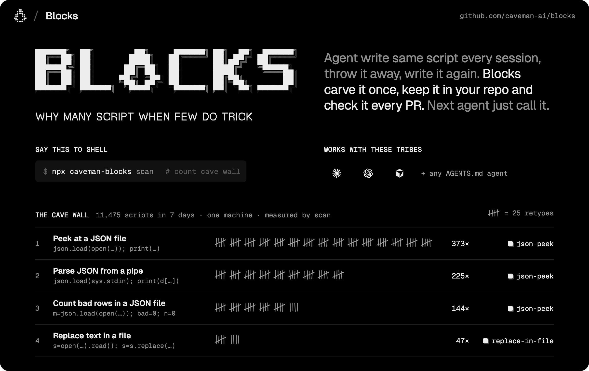

<div align="center">

<a href="https://github.com/caveman-ai/blocks"></a>

# why many script when few do trick

**Agent write same script every session. Agent throw script away. Agent write it again tomorrow, new typo. Blocks keep the script in your repo, check it, and hand it back. AKA skills.sh for codemode**

<a href="https://github.com/caveman-ai/blocks/stargazers"></a>
<a href="https://github.com/caveman-ai/blocks/releases"></a>
<a href="#-works-with"></a>
<a href="./LICENSE"></a>
<a href="https://github.com/JuliusBrussee/caveman"></a>

</div>

---

Every coding agent runs in code mode now. It writes a Python heredoc to peek at a JSON file, runs it, reads the answer and forgets the script existed. One week of one developer's transcripts held **11,475 of these scripts**, and a single shape, "load a JSON file and print some of it", showed up **373 times across 32 sessions**.

That's the dumbest waste in agent land, and the fix is boring: keep the script. Put it in the repo next to `AGENTS.md`, give it parameters and a small JSON answer, run its own example on every pull request, and tell the next agent it exists. That's a block.

## 🪨 Before / after

<table>
<tr>
<th width="50%">🗣️ Normal agent · every session, from scratch</th>
<th width="50%">🧱 Blocks agent · written once, called after</th>
</tr>
<tr>
<td valign="top">

```bash
python3 - <<'EOF'
import json
d = json.load(open('results/run-17.json'))
print(type(d).__name__, len(d))
print(list(d)[:20])
for k in list(d)[:3]:
    print(k, str(d[k])[:200])
EOF
```

Tomorrow: same script, different file, different bug. Nobody reviews it. Nobody keeps it.

</td>
<td valign="top">

```bash
caveman-blocks run json-peek --path results/run-17.json
```

```json
{"kind": "object", "keys": ["name", "version", "…"],
 "rows": 1, "sample": {"name": "…"}, "truncated": true}
```

One line to call, one small answer, checked in CI.

</td>
</tr>
</table>

**Same answer. Written once. Brain still big.**

| Thing | Blocks do |
|---|---|
| Script your agent wrote twice | 🧱 Becomes a block in `.blocks/` |
| Hardcoded path, id, port, date | 🙅 Becomes a param |
| 4 MB of JSON headed for the context window | 🤏 One small JSON answer. The runner cuts anything over 2 KB |
| Block that stopped working | 🚫 Fails `verify`, gets quarantined out of the index |
| Your command | ✋ Never denied, never rewritten. The hook only hints |
| Your code | 🏠 Stays in your repo. No hub, no account, no upload |
| The savings | 🧮 Counted and labelled measured. No dollar guesses |

## 📄 Like AGENTS.md, but it runs

`AGENTS.md` got one thing very right: a plain file, in the repo, that every agent reads. `.blocks/` is the same deal for what agents **do**. `AGENTS.md` says how; a block does it.

Because a block is code, something can check it. Prose can't fail a test, so a skill or a memory note drifts into confident nonsense and nobody finds out until an agent follows it off a cliff. A block has an exit code, a declared answer shape and a content hash it last passed with.

| | `AGENTS.md` | Skills | `.blocks/` |
|---|---|---|---|
| Holds | How your repo works | How to do a task | The script that does it |
| Written in | Prose | Prose, sometimes scripts | One Python file with a typed header |
| Checked by | Nobody | Nobody | `verify`, on every pull request |
| Answer | Whatever the agent decides | Whatever the agent decides | One JSON object, keys declared up front |

Blocks doesn't replace `AGENTS.md`; it lives in it. `init` writes eight rules and a one-line-per-block index into a marked section, inside the cached prompt prefix your agent already pays for, and `export` wraps blocks as `SKILL.md` files for agents that read skills.

These are the rules your agents get. They're opinions, and we hold them.

```text
BLOCKS. Scripts in this repo are reusable blocks in .blocks/. Rules:
1. Check the block index below first. If a block fits, run it. If one almost fits, add a param to it.
2. A script you would run twice, or over ~10 lines, becomes a block, not a heredoc or a /tmp file.
3. Inputs are params. No hardcoded paths, ids, ports or dates.
4. Print one small JSON object: the answer, not the data. Filter, count and truncate in code.
5. Exit 0 on success, non-zero with {"error": ...} on failure.
6. Safe to re-run: idempotent, no prompts, cleans up after itself.
7. Header first: name, summary, params, effects, example. caveman-blocks lint checks it.
8. Compose: call existing blocks with caveman-blocks run instead of copying their code.
```

## 🔍 Ask your own transcripts first

Don't take our word for any of this. `scan` reads the transcripts your agents already left on disk, groups every inline script by shape and shows which ones a first-party block covers. It works before you install anything else, and nothing leaves your machine.

```text
$ npx caveman-blocks scan --since 7d
Inline scripts your agents wrote, grouped by shape (measured, from local transcripts)

  373x  import json; d=json.load(open('cloud/agent-surface/capabili…  ~3 lines  32 sessions  covered by: json-peek (add)
  225x  import sys,json;d=json.load(sys.stdin);print(d['dist-tags']…  ~1 lines  36 sessions  covered by: json-peek (add)
  144x  import json; m=json.load(open('model.json')); bad=0; n=0; s…  ~7 lines  21 sessions  covered by: json-peek (add)
   47x  s = open('retrain.sh.draft').read(); s = s.replace('@@BEST@…  ~11 lines  15 sessions  covered by: replace-in-file (add)
   41x  import time; time.sleep(1)                                    ~1 lines  3 sessions
  … 1809 more shapes

Measured: 92142 shell commands, 11475 inline Python scripts, 1829 shapes. Not grouped: 6177 edits, 3 scripts without a shape.
```

That's the author's machine, one week, trimmed. Line five is a Python script whose whole job is to wait one second, written 41 times. Caveman see this. Caveman sad.

The longer study behind the design covers 201,785 shell calls over two months, including why half of all agent scripts are file edits that should never become blocks. It's in [docs/THESIS.md](docs/THESIS.md).

## ⚡ Install

```bash
npx caveman-blocks scan             # what your agents retyped this month. Works before init
npx caveman-blocks init             # .blocks/ in this repo, rules and index in AGENTS.md
npx caveman-blocks add json-peek    # copy a first-party block and its fixture in. You own it now
npx caveman-blocks hooks install    # once per machine: hints and capture for your agents
```

Then commit `.blocks/` and `AGENTS.md`, and add the [CI step](docs/CI.md) so a pull request can't ship a broken or unverified block.

> **Pre-release.** `v0.1.0-rc.1` is out as binaries on [Releases](https://github.com/caveman-ai/blocks/releases) for macOS, Linux and Windows. `npx`, Homebrew and `curl | sh` go live with `v0.1.0`.

## 🧱 What a block look like

One file. The header is data, the example doubles as the test, and the stamp is the receipt.

```python
#!/usr/bin/env python3
# /// block
# name = "json-peek"
# summary = "Shape of a JSON or JSONL file: keys, row count, one sample. Never the data."
# effects = "read"
# example = ["--path", "$FIXTURES/sample.json", "--depth", "2"]
# matches = ['json\.load\(open', 'json\.loads?\(.*\.read\(\)', 'json\.load\(sys\.stdin']
#
# [returns]
# keys = ["kind", "keys", "rows", "sample", "truncated"]
# doc = "kind is object|array|jsonl|scalar; keys are dotted paths, top level first, at most 20; rows is the array length, JSONL line count or 1; sample is the first element with values cut to 60 chars"
#
# [params]
# path = { type = "path", required = true, help = "JSON or JSONL file inside the repo" }
# depth = { type = "int", default = 2, min = 1, max = 10, help = "How deep to walk nested keys" }
#
# [provenance]
# created = "2026-10-03"
# source = "registry:json-peek@0.1.0"
#
# [stamp]
# verified = "6a6aa0c6a5d1"
# ///
```

The fence is [PEP 723](https://peps.python.org/pep-0723/) inline metadata with its own type name, so `uv run` and `pipx run` still treat the file as a plain script. `effects` sits on a ladder from `read` up to `external`: lint checks the code's imports against it, and the runner refuses any block whose effect your committed config doesn't allow, with `network` and `external` off until you turn them on. `matches` is how the hook recognizes the heredoc this block replaces. Full spec: [docs/FORMAT.md](docs/FORMAT.md).

## 🔁 How it work

1. **Hook sees the heredoc.** One pre-run hook sits on the shell tool. When a script matches a block, the agent gets one line: `Blocks: json-peek covers this. Next time: caveman-blocks run json-peek --path …`. When it's 10+ lines and new, the hook saves a scrubbed copy outside your repo as a candidate. It never denies or rewrites a command, and it writes nothing inside your repo.
2. **Agent promotes it.** `caveman-blocks promote` hands the agent a brief, the agent turns the candidate into a block, then runs `lint`, `verify` and `sync`.
3. **Block rides in the PR.** It lands in the pull request that needed it, and your reviewers read it like any other code.
4. **CI keeps it honest.** `verify --check` re-runs every example under the base branch's effect policy and writes nothing, so a pull request can't grant itself network access or slip in a block that fails.

`caveman-blocks stats` counts what happened: scripts captured, hints followed, block calls, block output kept out of context. Local, and labelled measured.

## 🧰 First-party blocks

Python 3.10+ standard library, each with fixtures, each verified in this repo's CI. `add` copies one into your repo; after that it's your code.

| Block | Effects | Replaces | Returns |
|---|---|---|---|
| `json-peek` | read | `json.load(open(…)); print(…)` | kind, keys, row count, one sample |
| `jsonl-stats` | read | Counter and aggregate loops | counts and sums grouped by a key |
| `test-summary` | exec | `go test … \| tail`, `pytest … \| grep` | passed, failed, first failure and its trace head, log path |
| `first-error` | read | tail and grep of build logs | first error line, context, line number |
| `wait-for` | read | `until …; do sleep 1; done` | met or not, elapsed seconds, last line |
| `grep-defs` | read | `grep -n "^func \|^type "` | definitions with line numbers |
| `http-json` | network | `curl … \| python -c "json.load…"` | status, selected keys, size, path of the full body |
| `replace-in-file` | write-workspace | read, `str.replace`, write | matches found, replaced, dry-run diff head, with an asserted match count |

## 🤝 Works with

Hooks for **Claude Code**, **Codex CLI** and **Cursor**, with Copilot CLI and Gemini CLI next. Any agent that reads `AGENTS.md` gets the rules and the index without a hook, and `export` covers agents that read Agent Skills.

## 🫣 What it doesn't do (yet)

- Blocks are Python only. Shell and JavaScript come later.
- There's no sandbox. Effects are declared, linted and gated, and `test-summary --cmd` can still run anything you can.
- No public hub, no cross-repo sharing. A block is visible to exactly the people who can see the repo, and we like it that way.
- No model calls in the CLI. Your agent does the thinking.
- End-to-end tests cover Claude Code's hook format. The Codex and Cursor adapters pass their own fixture tests but haven't run in a live session yet.

## 🪨 The Caveman family

[Caveman](https://github.com/JuliusBrussee/caveman) made agents talk less. Its proxy made them read less. Blocks makes them retype less. Same cave, same rule.

## 📚 Docs

| | |
|---|---|
| [THESIS](docs/THESIS.md) | Why, with the transcript data that shaped the design |
| [FORMAT](docs/FORMAT.md) | The block file format |
| [HOOK](docs/HOOK.md) | The hook's rule table and per-agent adapters |
| [INTEGRATION](docs/INTEGRATION.md) | Adding an agent in an afternoon |
| [AGENT-PROMOTION](docs/AGENT-PROMOTION.md) | How an agent turns a script into a block |
| [CI](docs/CI.md) | The CI step for repos that use Blocks |
| [ARCHITECTURE](docs/ARCHITECTURE.md) · [REPOSITORY](docs/REPOSITORY.md) · [ROADMAP](docs/ROADMAP.md) | Internals, layout, phases and gates |
| [decisions/](docs/decisions/README.md) · [research/](docs/research/) | Decision records, transcript scan, harness contracts |

## 📜 License

[Apache-2.0](./LICENSE). Fork it, ship it, put it in your monorepo. "Caveman" and the rock logo are trademarks; see [TRADEMARKS.md](TRADEMARKS.md).

## ⭐ Star

Blocks save your agent the retyping. Star cost zero. Fair trade.
